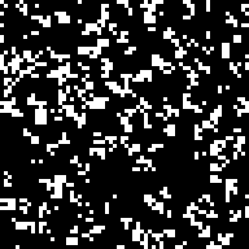

# Taichi.jl

[](https://lucifer1004.github.io/Taichi.jl/stable/)
[](https://lucifer1004.github.io/Taichi.jl/dev/)
[](https://github.com/lucifer1004/Taichi.jl/actions/workflows/CI.yml?query=branch%3Amain)
[](https://codecov.io/gh/lucifer1004/Taichi.jl)

[Taichi.jl](https://github.com/lucifer1004/Taichi.jl) is a thin wrapper around [Taichi](https://www.taichi-lang.org/). It is built upon two packages:

- [PythonCall.jl](https://github.com/cjdoris/PythonCall.jl) which makes Julia & Python easily interoperable.
- [Jl2Py.jl](https://github.com/lucifer1004/Jl2Py.jl) which transpiles Julia code to Python.

The general workflow is as follows:

```txt
||==========||                 ||==========||                 ||==========||
||  Julia   ||    Taichi.jl    ||  Python  ||      Taichi     ||  Taichi  ||
||          ||                 ||          || (via PythonCall)||          ||
||  kernel  ||   ===========>  ||  kernel  ||   ===========>  ||  kernel  ||
||==========||                 ||==========||                 ||==========||
```

There is a language-agnostic Taichi IR called `Chi` under development. After `Chi` becomes stable, we will switch to directly transpilation from Julia AST to `Chi` IR.

## Usage

`Taichi.jl` is very simple to use. The Python module `taichi` is exported as a constant `ti`. Then you can call most functions exactly the same way as in Python.

For wrapping kernel functions, two macros are exported, namely, `@ti_func` and `@ti_kernel`. The typical usage is to put the macro in front of an anonymous function, then assign it to a variable.

Following is a Julian adaptation of the "Julia set" example. Take caution that Python boolean values cannot be directly used in Julia, and we need to use helper functions like `pytruth` and `pyeq`. More examples can be seen in [examples](https://github.com/lucifer1004/Taichi.jl/tree/main/examples).

```julia
using Taichi

let
    ti.init(; arch=ti.gpu)
    n = 640
    pixels = ti.Vector.field(3; dtype=pytype(1.0), shape=(n * 2, n))

    paint = @ti_kernel (t::Float64) -> for (i, j) in pixels
        c = ti.Vector([-0.8, ti.cos(t) * 0.2])
        z = ti.Vector([i / n - 1, j / n - 0.5]) * 2
        rgb = ti.Vector([0, 1, 1])
        iterations = 0
        while z.norm() < 20 && iterations < 50
            z = ti.Vector([z[0]^2 - z[1]^2, z[0] * z[1] * 2]) + c
            iterations += 1
            pixels[i, j] = (1 - iterations * 0.02) * rgb
        end
    end

    gui = ti.GUI("Julia Set"; res=(n * 2, n))
    i = 0
    flag = 0
    while pytruth(gui.running)
        if flag == 0
            i -= 1
            if i * 0.02 <= 0.2
                flag = 1
            end
        else
            i += 1
            if i * 0.02 > (π * 1.2)
                flag = 0
            end
        end

        paint(i * 0.02)
        gui.set_image(pixels)
        gui.show()
    end
end
```

Screenshot of the example above:


You can run it from the repository root:

```bash
julia --project=. examples/juliaset.jl
```

## More Examples

### Game of Life



```bash
julia --project=. examples/gameoflife.jl
```

### FEM99


```bash
julia --project=. examples/fem99.jl
```
